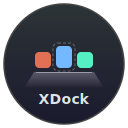
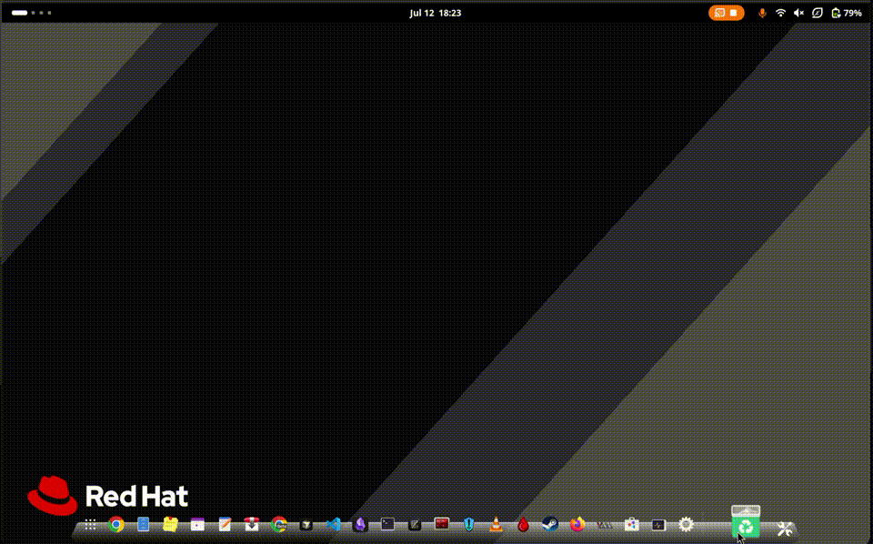

<p align="center">
  
</p>

<h1 align="center">XDock</h1>

<p align="center">
  <b>A community-driven dock for GNOME Shell</b><br>
  <sub>Forked from <a href="https://github.com/micheleg/dash-to-dock">Dash to Dock</a> · GNOME 45–50+ · Wayland & X11</sub>
</p>

<p align="center">
  <a href="https://github.com/dmzoneill-forks/xdock/actions/workflows/make.yml"></a>
  <a href="https://github.com/dmzoneill-forks/xdock/actions/workflows/test.yml"></a>
  <a href="https://github.com/dmzoneill-forks/xdock/actions/workflows/shexli.yml"></a>
  <a href="https://github.com/dmzoneill-forks/xdock/actions/workflows/security-codeql.yml"></a>
  <a href="https://github.com/dmzoneill-forks/xdock/actions/workflows/security-dependencies.yml"></a>
  <a href="https://github.com/dmzoneill-forks/xdock/actions/workflows/security-secrets.yml"></a>
</p>

---

<p align="center">
  
</p>

---

## Highlights

- **macOS-style shelf dock** — trapezoid 3D shelf with configurable angle, height, and corner radii
- **Parabolic icon magnification** — smooth zoom on hover with adjustable spread, scale, and easing
- **27+ tunable parameters** — spring physics, animation timing, preview delays, and more
- **Per-monitor dock positions** — different dock edges for different displays
- **Window previews on hover** — Aero Peek style with configurable opacity and timing
- **Shelf style with Cairo rendering** — gradient, highlight, border, and reflection controls
- **250+ integration tests** — real assertions against live GNOME Shell with visual regression

## Quick Install

```bash
git clone https://github.com/dmzoneill-forks/xdock.git
cd xdock
make install
```

Restart GNOME Shell (<kbd>Alt</kbd>+<kbd>F2</kbd> → `r` on X11, or log out/in on Wayland), then enable via GNOME Extensions.

## Documentation

| | |
|---|---|
| **[Development Guide](docs/DEVELOPMENT.md)** | Building from source, make targets, devkit workflow |
| **[Testing Guide](docs/TESTING.md)** | Test suites, visual regression, CI pipeline |
| **[Architecture](docs/ARCHITECTURE.md)** | Code structure, actor tree, settings system |
| **[Contributing](docs/CONTRIBUTING.md)** | How to contribute, code style, PR process |
| **[Integration Test Plan](test/INTEGRATION_TEST_PLAN.md)** | Test specifications and coverage |

## Want to help?

We're actively looking for co-maintainers. [Open an issue](https://github.com/dmzoneill-forks/xdock/issues/new?title=Maintainer+Interest&labels=maintainer) if you're interested.

## License

GPLv2+ — see [COPYING](COPYING) for details.
